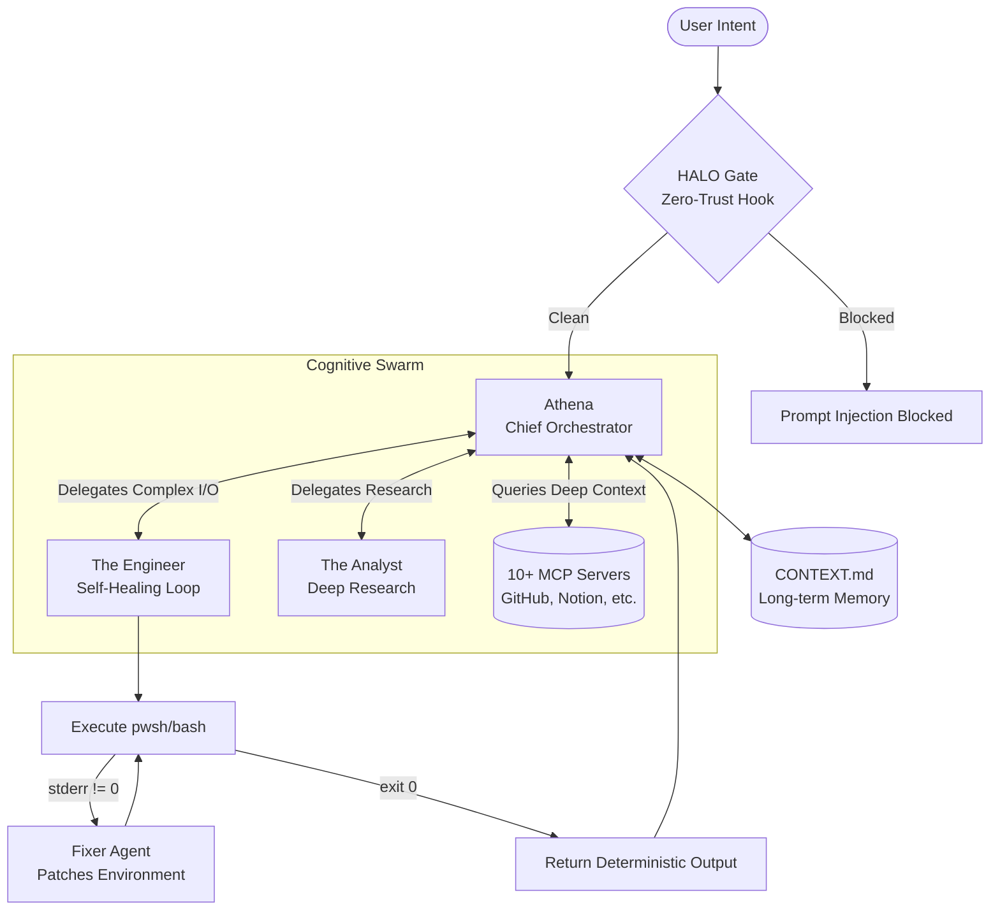
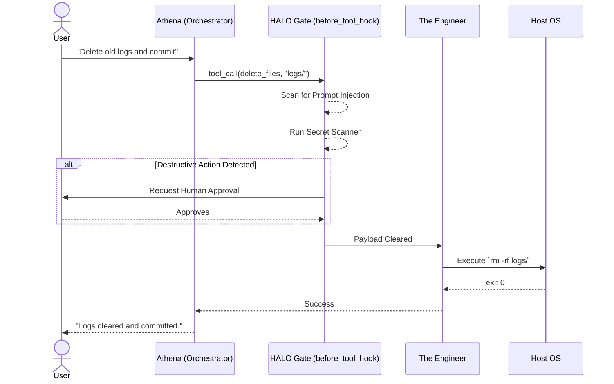

# Heccker-OS: The Sovereign Chief of Staff

**An ambient, high-agency intelligence built with Google ADK, fusing zero-trust execution with personalized swarm orchestration, all wrapped in a sleek React frontend.**

## 1. Project Overview - The Sovereign Chief of Staff

Heccker-OS is a multi-agent Chief of Staff built natively on the Google ADK. It unifies your development environment, authenticated emails, and a network of over 10 MCP servers into a single, cohesive workflow. Rather than acting as a passive chatbot, Heccker-OS operates as a proactive, autonomous companion that manages your digital footprint while strictly enforcing zero-trust security boundaries.

We have evolved past the terminal: Heccker-OS now features a full-stack FastAPI + React architecture with real-time SSE streaming, interleaved tool UI, and dynamic wellbeing vectors.

## 2. Problem Statement

Current multi-agent systems fail on two distinct fronts. First, they lack ambient awareness of the human operator. They suffer from cross-session amnesia and have no concept of schedule management or executive function scaffolding. Second, as agents gain OS-level execution powers, unconstrained peer-to-peer swarms become a massive security vulnerability. They lack deterministic boundaries to stop hallucinated, destructive commands from executing against the host environment.

## 3. Solution Statement

Heccker-OS replaces passive bots with Broad Cognitive Personas. By utilizing the ADK's advanced orchestration primitives, Heccker-OS achieves true Continuous Learning and autonomous execution. Crucially, it enforces strict, human-in-the-loop oversight for destructive actions, marrying autonomous capability with deterministic safety.

## 4. Architecture

Our architecture is a synthesis of two core philosophies: zero-trust deterministic execution, and ambient personalized orchestration. The swarm runs on four primary engines:

- **Athena (The Ambient Orchestrator)**: Athena operates as the central intelligence of the system with a highly conversational and engaging persona. She holds deep context about your schedule, triggers proactive wellbeing alerts, and handles dynamic onboarding for guests to ensure contextual isolation. The killer ADK integration is `write_memory`, which mutates `CONTEXT.md` to achieve true long-term Stored Intelligence. Athena also streams her thoughts live directly into the React UI so you are always in the loop.

  **Autonomous Wellbeing Interventions**: If you are in the zone hyperfocusing and completely ignoring your physical needs (like getting thirsty or skipping lunch), Athena proactively steps in. Utilizing background polling, she tracks your learned schedule and pushes non-intrusive vector art reminders (like a glass of water or a bowl of spaghetti) directly into your view to break the hyperfocus loop.

  

    
    
  

- **Executive Function Scaffolding (The Lock Screen & Nudges)**: Heccker-OS utilizes a dual-layered approach to user wellbeing. First, it features an autonomous background polling system that continuously checks your context and delivers proactive, friendly text nudges to ensure you stay hydrated or take breaks. Second, if you express during chat that you are getting dangerously overstressed or working past your hard-stop, Athena can invoke the native `lock_screen` tool. This forcefully locks your React UI with a full-screen modal, forcing you to step away and prioritize your health. Additionally, a native `set_timer` tool allows the agent to trigger a frontend focus timer with audio cues to structure your workflow.
- **The Analyst (Deep Research)**: A dedicated persona for heavy lifting. The Analyst handles complex web scraping, price comparisons, and staging products in a local shopping cart.
- **The MCP Network**: Athena connects to a network of over 10 MCP servers like GitHub, Gitea, Notion, Asana, and Slack. This lets the swarm traverse your digital footprint smoothly. Athena can even natively launch local desktop applications (like Spotify or your browser) when needed.
- **The Engineer (Self-Healing Loop)**: We weaponized the ADK's `LoopAgent` to give the swarm autonomous host execution. If a `pwsh` or `bash` command fails, the LoopAgent instantly intercepts the `stderr`, spawns a Fixer to patch the environment, and loops until the script succeeds.
- **The HALO Gate (Zero-Trust Hooks)**: Because Athena operates with such high execution agency, we utilized the ADK's `before_tool_hook` to act as a deterministic policy engine. It intercepts all payloads for prompt injection detection, runs pre-commit secret scanning, and explicitly pauses execution for human approval before any destructive OS action occurs.
- **Gemini Rate Limit Rotator (Resilience Engine):** To ensure the swarm never halts during intensive multi-agent execution, we built a custom `FallbackGemini` wrapper. If the primary model hits a Free Tier 429 Resource Exhausted quota, the system instantly rotates to a backup API key or gracefully downgrades to a lighter model (like `gemini-3.1-flash-lite`) without crashing the session.
- **Cloud ID Email Orchestration:** Athena natively connects to the user's authenticated email via IMAP/SMTP. She can autonomously read the latest unread emails, summarize them, and stage secure draft links for replies, functioning as a true Chief of Staff.

## 5. Next Steps & Roadmap

We built Heccker-OS to be as mathematically rigorous as it is ambient. Our future roadmap prioritizes deep background persistence and richer user interfaces.

| Phase                  | Focus Area          | Feature                                     | Status      |
| :--------------------- | :------------------ | :------------------------------------------ | :---------- |
| **Current**      | Interfaces          | **Full-Stack React Integration**      | Completed   |
| **Current**      | Scaffolding         | **Autonomous Background Nudges & Conversational UI Lock** | Completed   |
| **Next 30 Days** | Core Infrastructure | **Agentic Cron (Background Tasks)**   | Planned     |
| **Next 30 Days** | Core Infrastructure | **GUI Automation Layer (Non-API)**    | Planned     |
| **Q4 2026**      | Interfaces          | **Voice-Activated Concierge**         | Exploration |
| **Q4 2026**      | Integrations        | **Native Gitea/GitHub MCP**           | Exploration |
